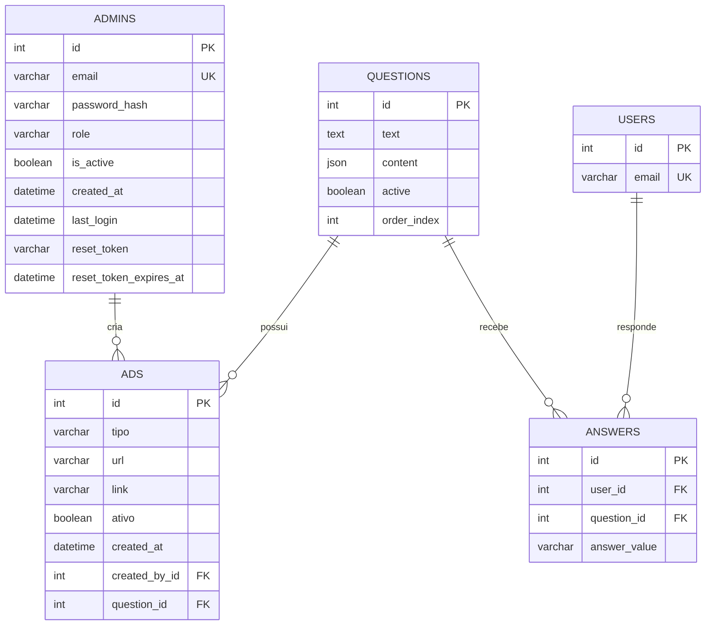

# Modelo Fisico do Banco de Dados

## 1. Visao Geral

O projeto usa `SQLAlchemy 2.x` com `create_all()` e, pelos pacotes instalados (`PyMySQL`), o SGBD-alvo mais provavel e `MySQL`.

A modelagem atual representa um sistema de pesquisa com:

- `users`: participantes identificados por e-mail
- `questions`: perguntas da pesquisa
- `answers`: respostas dos participantes
- `admins`: administradores do painel
- `ads`: propagandas associadas a perguntas e criadas por administradores

O modelo fisico abaixo foi derivado do codigo-fonte em:

- `app/modules/admin/models.py`
- `app/modules/survey/models.py`
- `app/modules/ads/models.py`
- `app/modules/*/schemas.py`
- `app/modules/*/service.py`

## 2. Leitura Tecnica do Modelo Atual

### Entidades e papel no dominio

1. `admins`
   Responsavel por autenticacao administrativa, criacao de anuncios e recuperacao de senha.

2. `users`
   Participante da pesquisa. O projeto hoje usa apenas e-mail como identificador funcional.

3. `questions`
   Pergunta exibida ao usuario. Suporta texto simples e um `content` em JSON para rich text.

4. `answers`
   Resposta de um usuario para uma pergunta. O sistema impede duplicidade por `user_id + question_id`.

5. `ads`
   Material publicitario vinculado a uma pergunta e a um administrador criador.

### Regras de negocio identificadas no codigo

- Um `user` e unico por e-mail.
- Um `admin` e unico por e-mail.
- Uma pergunta pode ter varias respostas.
- Um usuario pode responder cada pergunta no maximo uma vez.
- `answer_value` e tratado pela API como dominio fechado: `yes` ou `no`.
- `ads.tipo` e tratado pelo servico como dominio fechado: `image`, `youtube` ou `video`.
- `questions.content` guarda estrutura JSON de segmentos de texto estilizado.
- Somente perguntas `active = true` entram no fluxo normal da pesquisa.
- O fluxo de proxima pergunta depende de `order_index`.

### Observacoes importantes do estado atual

1. O ORM atual cria a maior parte da estrutura, mas nao explicita todos os checks de dominio no banco.
2. O projeto nao usa migracoes (`Alembic`), entao a estrutura depende de `Base.metadata.create_all()`.
3. Em `answers`, o codigo ja define `ON DELETE CASCADE` para usuario e pergunta.
4. Em `ads`, as FKs nao definem `ondelete`, entao o banco tendera a usar `RESTRICT`/comportamento padrao.
5. Existe uma pequena divergencia entre dominio de negocio e tipo fisico:
   `answer_value` e `tipo` sao `VARCHAR` no ORM, mas funcionam como enumeracoes no sistema.

## 3. Modelo Conceitual Resumido

## 4. Modelo Fisico Proposto

### Padrao adotado

- SGBD: MySQL 8+
- Engine: `InnoDB`
- Charset: `utf8mb4`
- Collation sugerida: `utf8mb4_unicode_ci`
- Chaves primarias: `INT AUTO_INCREMENT`
- Datas: `DATETIME`
- JSON nativo para `questions.content`

### Tabelas

#### `admins`

| Coluna | Tipo | Nulo | Regra |
|---|---|---:|---|
| `id` | `INT` | nao | PK, AI |
| `email` | `VARCHAR(255)` | nao | UK |
| `password_hash` | `VARCHAR(255)` | nao | hash bcrypt |
| `role` | `VARCHAR(50)` | nao | default `admin` |
| `is_active` | `BOOLEAN` | nao | default `true` |
| `created_at` | `DATETIME` | nao | default current timestamp |
| `last_login` | `DATETIME` | sim | ultimo acesso |
| `reset_token` | `VARCHAR(255)` | sim | indice simples |
| `reset_token_expires_at` | `DATETIME` | sim | expiracao do token |

Indices:

- `uk_admins_email (email)`
- `idx_admins_reset_token (reset_token)`

#### `users`

| Coluna | Tipo | Nulo | Regra |
|---|---|---:|---|
| `id` | `INT` | nao | PK, AI |
| `email` | `VARCHAR(255)` | nao | UK |

Indices:

- `uk_users_email (email)`

#### `questions`

| Coluna | Tipo | Nulo | Regra |
|---|---|---:|---|
| `id` | `INT` | nao | PK, AI |
| `text` | `TEXT` | nao | texto base |
| `content` | `JSON` | sim | rich text |
| `active` | `BOOLEAN` | nao | default `true` |
| `order_index` | `INT` | nao | default `0` |

Indices:

- `idx_questions_active_order (active, order_index)`

#### `answers`

| Coluna | Tipo | Nulo | Regra |
|---|---|---:|---|
| `id` | `INT` | nao | PK, AI |
| `user_id` | `INT` | nao | FK `users.id` |
| `question_id` | `INT` | nao | FK `questions.id` |
| `answer_value` | `ENUM('yes','no')` | nao | dominio fechado |

Indices e restricoes:

- `uk_answers_user_question (user_id, question_id)`
- `idx_answers_question_value (question_id, answer_value)`
- `fk_answers_user`
- `fk_answers_question`

Comportamento referencial:

- `user_id -> users.id`: `ON DELETE CASCADE ON UPDATE CASCADE`
- `question_id -> questions.id`: `ON DELETE CASCADE ON UPDATE CASCADE`

#### `ads`

| Coluna | Tipo | Nulo | Regra |
|---|---|---:|---|
| `id` | `INT` | nao | PK, AI |
| `tipo` | `ENUM('image','youtube','video')` | nao | dominio fechado |
| `url` | `VARCHAR(500)` | nao | caminho, URL ou id de video |
| `link` | `VARCHAR(500)` | sim | landing page |
| `ativo` | `BOOLEAN` | nao | default `true` |
| `created_at` | `DATETIME` | nao | default current timestamp |
| `created_by_id` | `INT` | nao | FK `admins.id` |
| `question_id` | `INT` | nao | FK `questions.id` |

Indices e restricoes:

- `idx_ads_tipo (tipo)`
- `idx_ads_created_by_id (created_by_id)`
- `idx_ads_question_ativo (question_id, ativo)`
- `fk_ads_created_by`
- `fk_ads_question`

Comportamento referencial sugerido:

- `created_by_id -> admins.id`: `ON DELETE RESTRICT ON UPDATE CASCADE`
- `question_id -> questions.id`: `ON DELETE RESTRICT ON UPDATE CASCADE`

Justificativa:

- anuncios sao registros administrativos e nao devem ficar orfaos;
- excluir uma pergunta que possui anuncio associado deve exigir decisao explicita.

## 5. Script Fisico Recomendado

O script correspondente foi criado em:

- [schema_fisico_mysql.sql](/h:/projeto%20pena%20de%20morte/penademorteback/docs/schema_fisico_mysql.sql)

## 6. Diferencas Entre o Banco Atual e o Modelo Recomendado

### Ja refletido no ORM atual

- tabelas principais
- chaves primarias
- unicidade de e-mail em `admins` e `users`
- unicidade composta em `answers`
- JSON em `questions.content`
- cascata de exclusao em `answers`

### Recomendado reforcar no banco

1. Converter dominios logicos para dominio fisico:
   - `answers.answer_value`: `ENUM('yes','no')`
   - `ads.tipo`: `ENUM('image','youtube','video')`

2. Criar indices compostos voltados ao uso real:
   - `questions(active, order_index)`
   - `answers(question_id, answer_value)`
   - `ads(question_id, ativo)`

3. Formalizar nomes de constraints e FKs no DDL.

4. Padronizar `created_at` com `DEFAULT CURRENT_TIMESTAMP` no banco, alem do `default` da aplicacao.

## 7. Riscos e Ajustes Estruturais Percebidos

1. `create_all()` nao substitui migracoes versionadas.
   Sem migracao, evolucoes de coluna, indice e constraint podem divergir entre ambientes.

2. O modelo atual nao registra `created_at` em `answers`, o que limita auditoria temporal de respostas.

3. `users` tem apenas e-mail.
   Se houver necessidade futura de LGPD, origem de consentimento, IP, device ou data de entrada, sera preciso ampliar a entidade.

4. `questions.order_index` nao possui unicidade.
   Hoje duas perguntas podem ocupar a mesma posicao logica.

5. `ads.url` mistura conceitos.
   Para `image/video`, guarda caminho/URL; para `youtube`, guarda identificador. Isso funciona, mas reduz normalizacao semantica.

## 8. Melhorias Estruturais Sugeridas

### Curto prazo

- adotar migracoes com `Alembic`
- aplicar os indices compostos
- reforcar os dominios no banco

### Medio prazo

- adicionar `created_at` e possivelmente `updated_at` em `answers`
- avaliar `UNIQUE(order_index)` em `questions`, se a ordem precisar ser estritamente unica
- considerar `updated_at` em `questions` e `ads`

### Se o projeto crescer

- separar armazenamento de midia de metadados de anuncios
- criar tabela de auditoria administrativa
- versionar perguntas e seus blocos JSON

## 9. Conclusao

O banco atual e pequeno, coerente e suficiente para o fluxo principal da aplicacao. O principal ganho agora nao e criar novas tabelas, mas consolidar o modelo fisico com:

- dominios fechados no banco
- indices de consulta reais
- estrategia de migracao
- padronizacao explicita de constraints

Isso preserva a simplicidade do projeto e aumenta bastante a confiabilidade estrutural.
